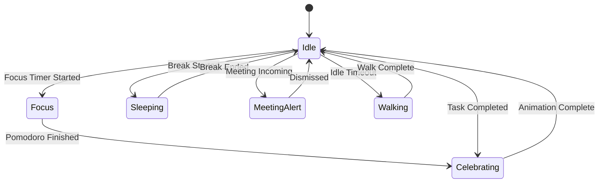
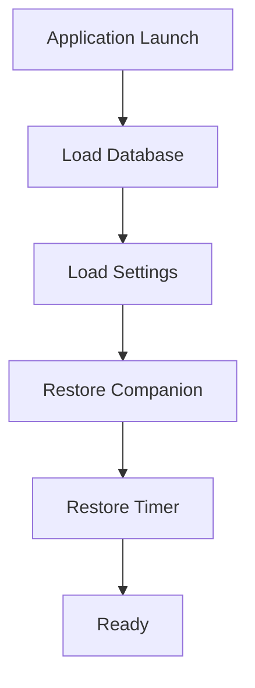
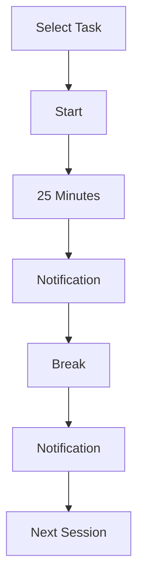
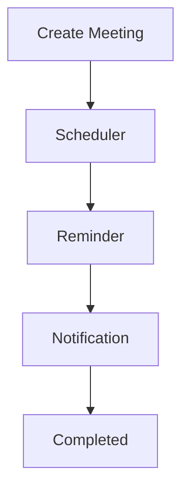
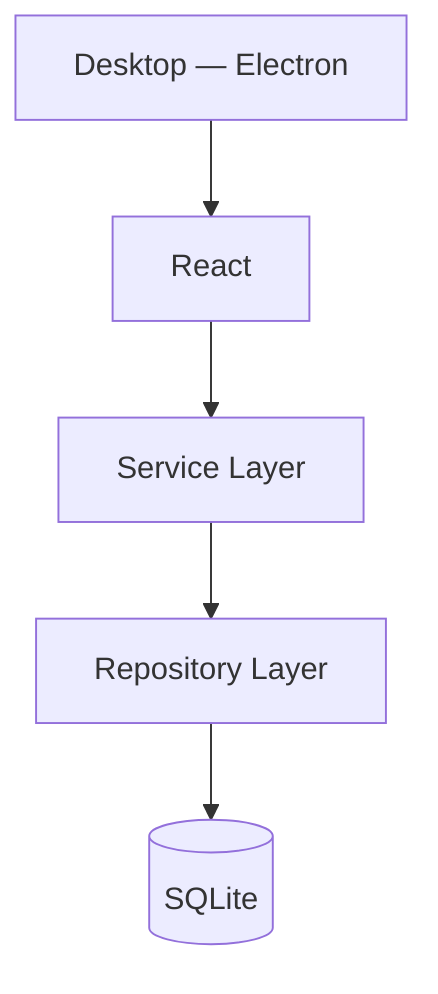

# Focus Companion

> Product Requirements Document (PRD)

| Key            | Value          |
| -------------- | -------------- |
| **Version**    | 1.0            |
| **Status**     | Draft          |
| **Owner**      | Fathur Lambang |
| **Last Updated** | 2026-06-28   |

---

## 1. Product Vision

Focus Companion adalah aplikasi desktop yang membantu pengguna tetap fokus saat bekerja melalui kombinasi Pomodoro Timer, Task Management, Meeting Reminder, dan Desktop Companion yang selalu menemani pengguna selama bekerja.

Berbeda dengan aplikasi Pomodoro biasa, Focus Companion memiliki karakter (Desktop Companion) yang memberikan feedback visual terhadap aktivitas pengguna tanpa mengganggu pekerjaan.

Versi pertama **tidak menggunakan AI**.

Semua proses berjalan secara lokal.

---

## 2. Goals

### Primary Goals

- Membantu pengguna menjaga fokus
- Mengurangi distraksi
- Mengingatkan meeting
- Mencatat histori pekerjaan
- Memberikan visual feedback melalui Desktop Companion

### Secondary Goals

- Menjadi productivity app yang ringan
- Tidak membutuhkan koneksi internet
- Tidak membutuhkan akun
- Tidak membutuhkan server

---

## 3. Target Users

| User              | Activities                                   |
| ----------------- | -------------------------------------------- |
| Software Engineer | Coding, debugging, sprint                    |
| UI Designer       | Bekerja berdasarkan task, membutuhkan timer   |
| Student           | Belajar, mengerjakan skripsi, membaca         |
| Freelancer        | Tracking waktu, reminder meeting client       |

---

## 4. Product Principles

| Principle          | Description                                            |
| ------------------ | ------------------------------------------------------ |
| Offline First      | Semua fitur berjalan tanpa koneksi internet             |
| Fast               | Responsif dan cepat dalam setiap interaksi              |
| Lightweight        | Konsumsi resource minimal                               |
| Minimal UI         | Antarmuka sederhana dan tidak membingungkan              |
| Zero Configuration | Langsung bisa dipakai tanpa setup                       |
| Privacy First      | Data tersimpan lokal, tidak ada telemetri               |

---

## 5. Supported Platform

- Windows
- macOS

Linux akan dipertimbangkan setelah v1.

---

## 6. MVP Features

### Pomodoro Timer

- Start
- Pause
- Resume
- Stop
- Skip Break
- Custom Duration
- Auto Break
- Auto Next Session

### Task Management

- Create Task
- Edit Task
- Delete Task
- Complete Task
- Current Task
- Task History

### Meeting Reminder

**Manual Input**

| Field           | Description              |
| --------------- | ------------------------ |
| Title           | Judul meeting            |
| Date            | Tanggal meeting          |
| Start Time      | Waktu mulai              |
| End Time        | Waktu selesai            |
| Description     | Deskripsi meeting        |
| Reminder Before | Waktu pengingat sebelum  |

**Reminder Option:** 5 minutes · 10 minutes · 15 minutes · 30 minutes

Notification akan muncul meskipun aplikasi berada di tray.

### Statistics

**Hari Ini**

- Focus Time
- Break Time
- Sessions
- Completed Tasks

**Mingguan · Bulanan**

### Notification

**Native Notification**

- Pomodoro Finished
- Break Finished
- Meeting Reminder
- Task Completed

### System Tray

**Tray Menu**

- Show App
- Start Timer
- Pause Timer
- Resume Timer
- Current Task
- Settings
- Exit

---

## 7. Desktop Companion

### Overview

Desktop Companion merupakan karakter kecil yang berada di desktop.

Companion **tidak menggunakan AI**.

Semua animasi bersifat event-driven.

### Features

- Always On Top
- Transparent Window
- Frameless
- Drag & Drop
- Click Menu
- Hide Companion
- Resize
- Opacity
- Lock Position

### Upload Character

User dapat mengupload:

- PNG
- WEBP

Companion menggunakan gambar tersebut.

### Character State

`Idle` · `Focus` · `Walking` · `Sleeping` · `Happy` · `Celebrating` · `Meeting Alert` · `Hidden`

### State Transition



### Companion Menu

Klik Companion → Menu:

- Start Timer
- Pause Timer
- Resume Timer
- Current Task
- Next Meeting
- Settings
- Hide

### Companion Settings

| Setting              | Options                                           |
| -------------------- | ------------------------------------------------- |
| Size                 | Small · Medium · Large                            |
| Opacity              | 25% · 50% · 75% · 100%                           |
| Position             | Top Left · Top Right · Bottom Left · Bottom Right · Custom |
| Walk Around          | Enable · Disable                                  |
| Click Through        | Enable · Disable                                  |
| Auto Hide Fullscreen | Enable · Disable                                  |

---

## 8. Future Desktop Companion

Tidak termasuk MVP.

- AI Chat
- Voice
- Emotion
- Gesture Learning
- Live2D
- Multiple Characters

---

## 9. User Flow

### Application Launch



### Timer Flow



### Meeting Flow



---

## 10. Database Design

### tasks

| Field       | Type     | Description              |
| ----------- | -------- | ------------------------ |
| id          | INTEGER  | Primary key              |
| title       | TEXT     | Judul task               |
| description | TEXT     | Deskripsi task           |
| status      | TEXT     | Status task              |
| priority    | INTEGER  | Prioritas task           |
| created_at  | DATETIME | Waktu dibuat             |
| updated_at  | DATETIME | Waktu terakhir diubah    |

### pomodoro_sessions

| Field      | Type     | Description                |
| ---------- | -------- | -------------------------- |
| id         | INTEGER  | Primary key                |
| task_id    | INTEGER  | FK ke tasks                |
| start_time | DATETIME | Waktu mulai sesi           |
| end_time   | DATETIME | Waktu selesai sesi         |
| duration   | INTEGER  | Durasi dalam detik         |
| completed  | BOOLEAN  | Apakah sesi selesai        |

### meetings

| Field           | Type     | Description                 |
| --------------- | -------- | --------------------------- |
| id              | INTEGER  | Primary key                 |
| title           | TEXT     | Judul meeting               |
| description     | TEXT     | Deskripsi meeting           |
| date            | DATE     | Tanggal meeting             |
| start_time      | TIME     | Waktu mulai                 |
| end_time        | TIME     | Waktu selesai               |
| reminder_before | INTEGER  | Menit sebelum reminder      |
| status          | TEXT     | Status meeting              |

### settings

| Field              | Type    | Description                  |
| ------------------ | ------- | ---------------------------- |
| id                 | INTEGER | Primary key                  |
| theme              | TEXT    | Tema aplikasi                |
| language           | TEXT    | Bahasa                       |
| pomodoro_duration  | INTEGER | Durasi pomodoro (detik)      |
| short_break        | INTEGER | Durasi istirahat pendek      |
| long_break         | INTEGER | Durasi istirahat panjang     |
| auto_break         | BOOLEAN | Otomatis mulai break         |
| auto_start         | BOOLEAN | Otomatis mulai sesi          |
| tray_enabled       | BOOLEAN | System tray aktif            |
| companion_enabled  | BOOLEAN | Companion aktif              |

### companion

| Field          | Type    | Description                |
| -------------- | ------- | -------------------------- |
| id             | INTEGER | Primary key                |
| character_name | TEXT    | Nama karakter              |
| image_path     | TEXT    | Path gambar karakter       |
| size           | TEXT    | Ukuran (small/medium/large)|
| opacity        | REAL    | Tingkat transparansi       |
| position_x     | INTEGER | Posisi X di layar          |
| position_y     | INTEGER | Posisi Y di layar          |
| behavior       | TEXT    | Perilaku companion         |
| click_through  | BOOLEAN | Click-through aktif        |
| lock_position  | BOOLEAN | Posisi dikunci             |

---

## 11. Architecture



---

## 12. Folder Structure

```text
focus-companion/
├── app/
│   ├── electron/
│   ├── database/
│   └── assets/
├── public/
├── src/
│   ├── components/
│   ├── features/
│   │   ├── pomodoro/
│   │   ├── tasks/
│   │   ├── meeting/
│   │   ├── statistics/
│   │   ├── settings/
│   │   └── desktop-companion/
│   ├── hooks/
│   ├── services/
│   ├── repositories/
│   ├── ipc/
│   ├── database/
│   ├── types/
│   ├── utils/
│   ├── store/
│   └── styles/
└── tests/
```

---

## 13. Technology Stack

| Category   | Technology       |
| ---------- | ---------------- |
| Language   | TypeScript       |
| Desktop    | Electron         |
| Frontend   | React            |
| Bundler    | Vite             |
| UI         | TailwindCSS      |
| Components | shadcn/ui        |
| State      | Zustand          |
| Database   | SQLite           |
| ORM        | Drizzle ORM      |
| Validation | Zod              |
| Testing    | Vitest, Playwright |
| Logging    | electron-log     |
| Update     | electron-updater |
| Packaging  | electron-builder |

---

## 14. Non Functional Requirements

| Requirement    | Target                |
| -------------- | --------------------- |
| Startup        | < 3 seconds           |
| Memory         | < 250 MB              |
| Database       | SQLite                |
| Offline        | 100%                  |
| Crash Recovery | Automatic             |
| Cross Platform | Windows, macOS        |

---

## 15. Roadmap

| Phase   | Focus                      | Features                                                        |
| ------- | -------------------------- | --------------------------------------------------------------- |
| Phase 1 | Core App                   | Timer, Tasks, Tray, SQLite                                      |
| Phase 2 | Enhancement                | Statistics, Meeting Reminder, Desktop Companion, Settings, Export, Import |
| Phase 3 | Integration                | Google Calendar Sync, Cloud Sync, Themes, Custom Companion Packs |
| Phase 4 | AI                         | AI Companion, Voice, Chat, Memory, Suggestions                   |

---

## 16. Risks

| Risk                              | Mitigation                                      |
| --------------------------------- | ----------------------------------------------- |
| Transparent window compatibility  | Test di Windows & macOS, fallback ke opaque      |
| Multi-monitor positioning         | Deteksi monitor aktif, simpan per-monitor config |
| Notification permission           | Panduan user untuk enable, graceful fallback     |
| Auto-update reliability           | Rollback mechanism, manual download option       |
| Sprite animation performance      | Optimasi frame rate, lazy load assets            |

---

## 17. Success Metrics

| Metric             | Target              |
| ------------------ | -------------------- |
| Daily Active Users | Tracking             |
| Average Focus Time | Tracking             |
| Sessions Per Day   | Tracking             |
| Completed Tasks    | Tracking             |
| Reminder Accuracy  | > 99%                |
| Crash Rate         | < 0.1%               |
| Startup Time       | < 3 seconds          |

---

## 18. Acceptance Criteria

### Pomodoro

- [ ] Timer berjalan akurat
- [ ] Pause & Resume bekerja
- [ ] Notification muncul

### Task

- [ ] CRUD berjalan
- [ ] Task tersimpan

### Meeting

- [ ] Reminder tepat waktu
- [ ] Notification tetap muncul ketika aplikasi berada di tray

### Desktop Companion

- [ ] Upload PNG berhasil
- [ ] Drag berjalan
- [ ] Resize berjalan
- [ ] Opacity berjalan
- [ ] Event animation berjalan

### Application

- [ ] Berjalan offline
- [ ] Startup < 3 detik
- [ ] Database tidak corrupt
- [ ] Auto update bekerja

---

## 19. Future Vision

Focus Companion akan berkembang dari aplikasi Pomodoro menjadi **Desktop Productivity Companion Platform**.

Roadmap jangka panjang:

| Category         | Integrations / Features                                          |
| ---------------- | ---------------------------------------------------------------- |
| AI               | AI Productivity Assistant, AI-powered Productivity Insights      |
| Calendar         | Google Calendar Integration, Outlook Integration                 |
| Dev Tools        | Jira Integration, GitHub Integration                             |
| Productivity     | Notion Integration, Habit Tracker, Daily Journal                 |
| Communication    | Slack Integration, Discord Integration                           |
| Analytics        | Time Analytics Dashboard                                         |
| Collaboration    | Team Collaboration                                               |
| Extensibility    | Plugin System, Theme Marketplace, Character Marketplace          |
| Cross-device     | Cross-device Sync, Mobile Companion App                          |

Filosofi produk adalah menjadi "teman kerja" yang selalu hadir di desktop pengguna: ringan, tidak mengganggu, namun memberikan informasi dan dorongan yang tepat waktu untuk membantu pengguna bekerja lebih fokus dan produktif.
